# Credit_Risk_Analysis

## Overview of the analysis 
The purpose of this analysis is to use machine learning to access credit card risk from a dataset provided by LendingClub. 

## Results

* Balanced Random Forest Classifier

Using the balanced random forest model the balanced accuracy score was 0.5131620876640448. 

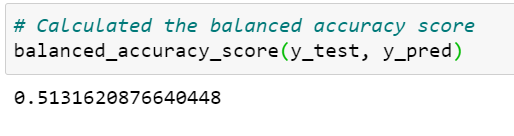

The overall precision score is nearly a perfect score for this model, however the high risk credit cards have a very low score.  The recall average is below average for what we would want within this model.  The recall score for the high risk credit cards is a reasonably good score for the model, however the low risk credit cards has a lower than average recall score. 

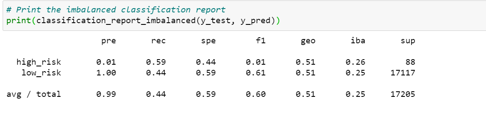

* Easy Ensemble AdaBoost Classifier

Using the easy ensemble model the balanced accuracy score was 0.5152503226457483. 

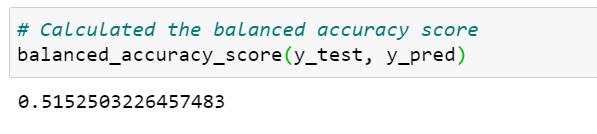

The overall precision score is nearly a perfect score for this model, however the high risk credit cards have a very low score.  The recall average is below average for what we would want within this model.  The recall score for the high risk credit cards is a reasonably good score for the model, however the low risk credit cards has a lower than average recall score. 

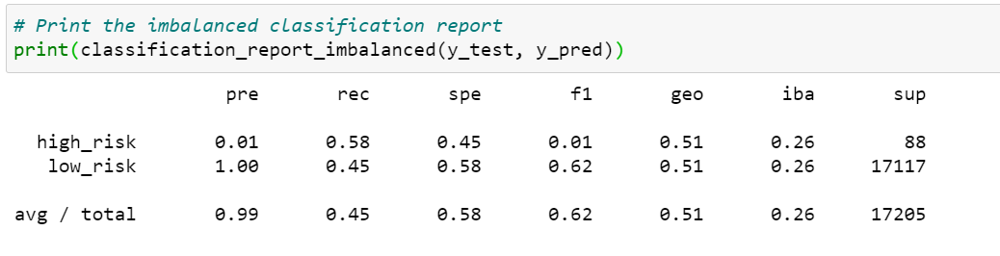

* Naive Random Oversampling 

Using the naive random oversampling model the balanced accuracy score was 0.5. 

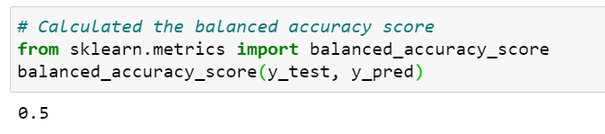

The average precision scores as well as individually are the lowest possible result that can be generated. The recall score for the high risk credit cards is perfect meaning we can rely on the results from this metric.  The recall score for the low risk cards are so low however it makes the average score extremely low and unreliable. 

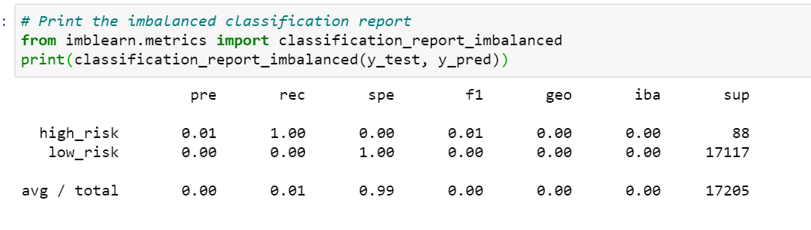

* SMOTE Oversampling 

Using the SMOTE oversampling model the balanced accuracy score was 0.5. 

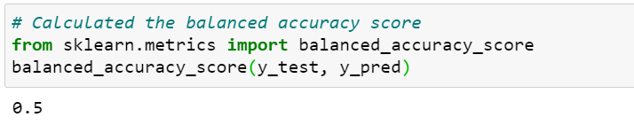

The average precision scores as well as individually are the lowest possible result that can be generated. The recall score for the high risk credit cards is perfect meaning we can rely on the results from this metric.  The recall score for the low risk cards are so low however it makes the average score extremely low and unreliable.

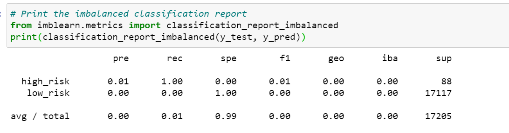

* Undersampling 

Using the undersampling model the balanced accuracy score was 0.5. 

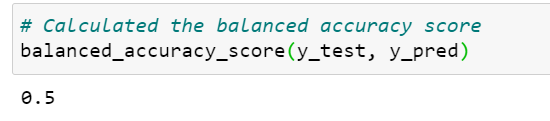

The average precision scores as well as individually are the lowest possible result that can be generated. The recall score for the high risk credit cards is perfect meaning we can rely on the results from this metric.  The recall score for the low risk cards are so low however it makes the average score extremely low and unreliable.

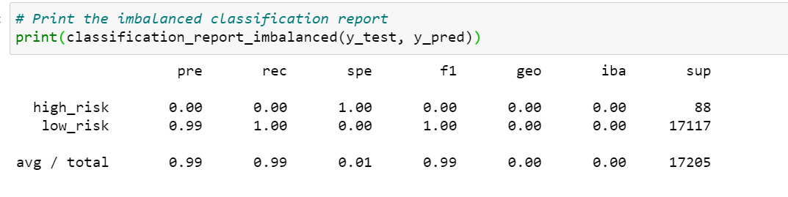

* Combination (Over and Under) Sampling 

Using the combination sampling model the balanced accuracy score was 0.5. 

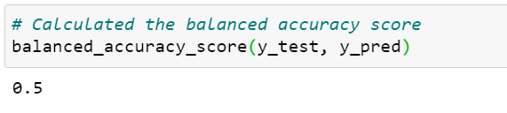

The average precision scores as well as individually are the lowest possible result that can be generated. The recall score for the high risk credit cards is perfect meaning we can rely on the results from this metric.  The recall score for the low risk cards are so low however it makes the average score extremely low and unreliable.

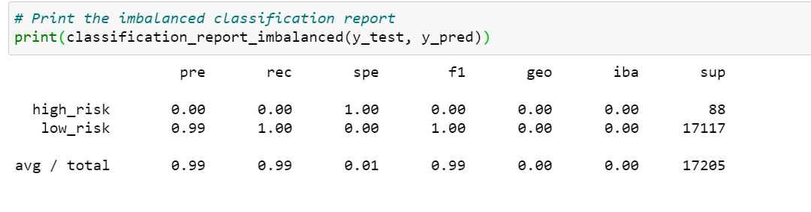

##Summary 
Majority of the machine learning models created the same accuracy score with a similar classification report.  I recommend the balanced random forest model as it provided a detailed accuracy score.  Using this model provides a larger reach into the dataset, which provides a more accurate prediction. 
